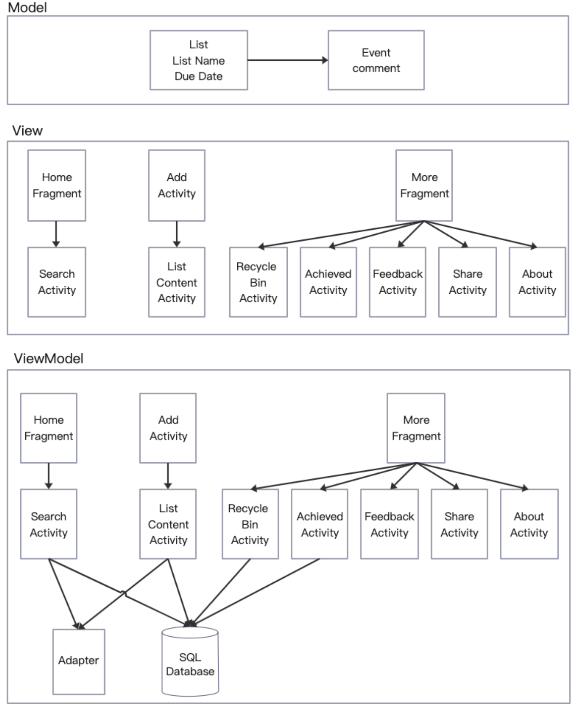
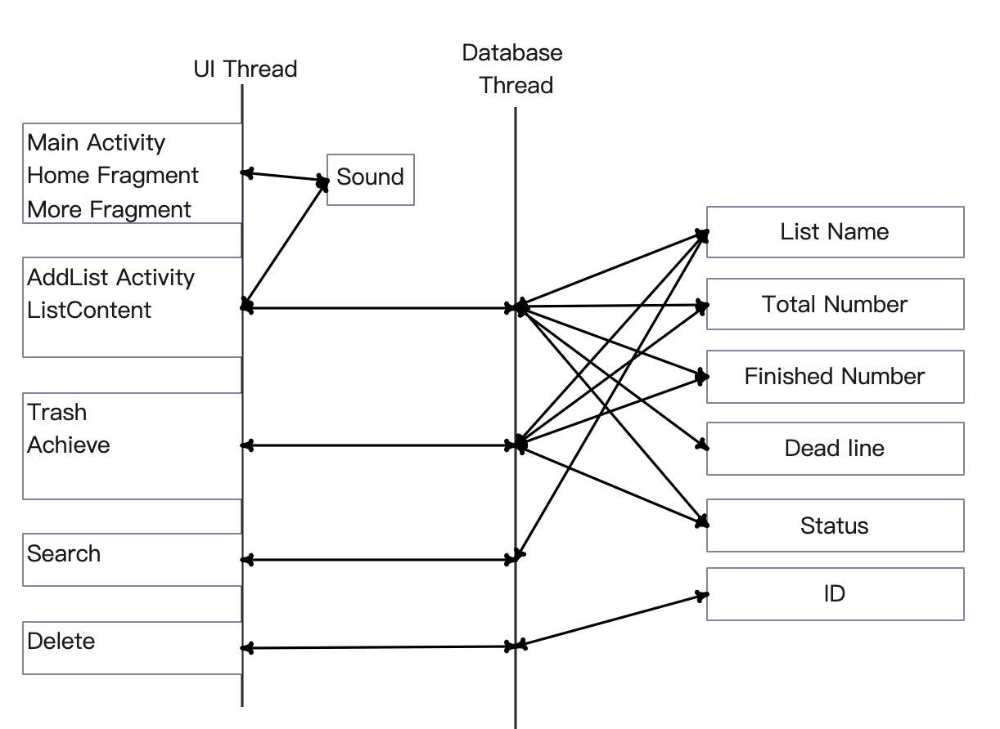

# WooHooSchedule-APP
WooHooSchedule APP for the SFU-CMPT362 Group Project, this is a super easy to use event management application

# Features overview
1. Easy for daily schedule 
2. Track scheduled events 
3. Visual completion (Completion for todo list)
4. A solid base for adding creative extensions
5. Data visualization (deadline date, #of completed and rest)
6. Free app without any advertisements and costs!

# MVVM diagram

# Thread diagram

# What we did in Show_and_Tell_1
1. Create an initialized Schedule List
2. Create a title and deadline when adding a list
3. Can add any number of events to the list
4. Can delete the list and achieve (Here, delete is not deleted directly, but to the recycle bin, and the recycle bin has not finished)
5. When an item in the list is completed, you can click ⭕ on the left to indicate completion and click again to cancel
6. On the homepage, you can see the completion of each list. When all tips in a list are complete, green "√" is displayed. If the deadline is exceeded, a red "!" will appear
7. Includes the function of recycling bins in "More"(To be continued)
8. The application will store the data locally. It could be private
9. The button and color we used are from [ shadow-layout](https://github.com/dmytrodanylyk/shadow-layout)

## Basic use to create Todo

## Three cases of the Todo list show in homepage

# What we did in Show_and_Tell_2
1. Implemented deleting operation (tapping and holding with dialog showing) for Todo list(s) on the home page
2. Implemented the fast deleting operation (tapping and holding without dialog showing) for items in each Todo list
3. Created a recycle bin on the "More" page for users that have the chance to undo the deletion
4. Implemented the "Feedback" function in order to link emails on the "More" page
5. Implemented the "Share" function in order to sharing this App's API on the "More" page
6. Showed more details about this WooHoo App on the "More" page
7. Implemented the music feedback when opening this App and adding (or modifying) Todo(s)

# What we did in final
1. Search function 🔍 on the right tab of the homepage; we will continue to implement this function for searching the list without the entire list name
2. Add profile function
3. Refine more design details and keep the code clean

###  Contributor
1. Weilong Xu
2. Handa Huang
3. Junchen Li
4. Siwei Wang
5. Haojie Huang

